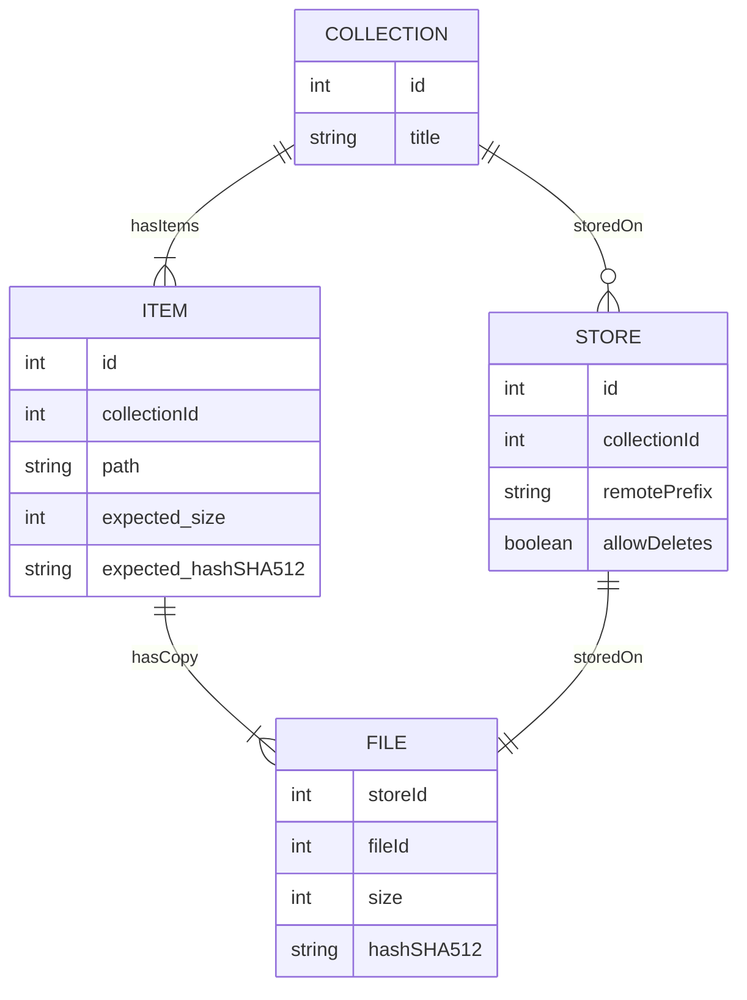

# drumknott
An experimental digital [clerk](https://wiki.lspace.org/Rufus_Drumknott).

This is just some notes on an idea for now. Some kind of digital preservation workbench in the browser. A bit like [CyberChef](https://gchq.github.io/CyberChef/), but more a usable 'workbench' for digital preservationers.

## Goal

We need to do basic stuff like scan files, do checksum checks, identify formats. This is often a pain because installing software is a pain. Can we run something useful, just using the browser? There are a lot of things that can run in or be cross-compiled via WASM, so maybe we can make something useful?

## Outline

- We can use the [File System API](https://developer.mozilla.org/en-US/docs/Web/API/File_System_API) (at least in Chrome and Edge) to be given access to a user directory on their local machine.
- We could scan a directory from a [Web Worker](https://developer.mozilla.org/en-US/docs/Web/API/Web_Workers_API/Using_web_workers), and store information about the files (basic inventory, sizes etc.) in an [IndexedDB](https://developer.mozilla.org/en-US/docs/Web/API/IndexedDB_API).
- Other workers could be tasked with running other background tasks:
    - We could run [Siegfried](https://www.itforarchivists.com/siegfried), as per https://siegfried-js.glitch.me/
    - Would run other fancier tools, like `ffprobe` (see below)
    - We could calcuate content hashes, e.g. using https://github.com/satazor/js-spark-md5
- We could export the inventory data as: 
    - [SQLite](https://sqlite.org/wasm/doc/trunk/persistence.md#opfs)
    - [Parquet](https://kylebarron.dev/parquet-wasm/)
    - plain `filepath hash` inventory files a la `md5sum`
    - BagIt?
- We could even run [rclone](https://github.com/rclone/rclone/tree/f491efc85d0bc6c674520331f315b51f060a6b92/fs/rc/js#rclone-as-wasm) and use it to manage data.
- There's also an increasing amount of format-specific tools that may work with WASM, e.g from Rust or Go ecosystems:
    - [pdfcpu ships a WASM release](https://github.com/pdfcpu/pdfcpu)
    - [ffmpeg.wasm](https://github.com/ffmpegwasm/ffmpeg.wasm) exists, so `ffprobe` should be possible. See also [GIF playback via ffmpeg.wasm](https://brunoluiz.net/blog/2022/jan/gif-sane-playback-control-ffmpegwasm/)
    - [ImageWand](https://brunoluiz.net/blog/2022/aug/imagewand-privacy-first-image-conversion-experiment-with-golang-and-wasm/) is an example image toolkit using Go WASM
    - Ruffle (Flash in Rust)

In principle, a `pdfcpu`-based PDF validator would be pretty simple to do, for example.  More generally, probably would need some kind of standard API/wrapping to make it possible to dynamically pull in different format-specific WASM chunks depending on what we find.

# Older Notes

Monitoring your files.

Links to: Preservation _With_ The Cloud 



## Rough Notes

Collections
ID, Title (unique)
1, UKWA NPLD

Remotes/Stores
ID, Collection_ID, Remote (unique), Allow_Deletes
1, 1, 'hdfs://namenode:8012/heritrix/output', 'false'
2, 1, 'hdfs://h3nn:8012/heritrix/output', 'false'
3, 1, 'hdfs://nlsh3nn:8012/heritrix/output', 'false'
4, 1, 'file://mnt/gluster/heritrix/output', 'true'

(
i.e. we manage replica relationships as commands:
 - h020 copy-to nls.h3
 - gluster move-to h3

But the Allow_Deletes field lets us control whether move-to is allowed, so it's not called accidentally.
}

Files
ID, Collection_ID, Path, Verified_Size, Verified_Hash
1, 1, frequent-npld/test.txt, NULL, NULL

Replicas
Remote_ID, File_ID, Size, Last_Seen

Replica_Sizes
Remote_ID, File_ID, Size

Hashes
HASH, Size, ???

Replica_Hashes
Remote_ID, File_ID, HASH?


Questions:

Which files are replicated, based on path and size.
Which files are replicated, based on path, size and hash.
Which files need replication?
Which files have changed? What changed and when?
Which files have been indexed, etc.


JOBS:

- Scan source X (in chunks) and update records.
- Find conflicts/changes and raise them for review.
- Review conflicts and resolve (record correct hash, size, or remove old out-of date records) ???
    - Files is in one place not in the other(s) (need replication).
    - Files differ between places (needs correct hash+size).
    - Files change size or hash (need removing to permit update?).
- Find files that need replicating, run a job to replicate them, and record result.
- Find files that need hash-checking, check and record result.
- Find files that need indexing, and index them, and record result.
- ANTIJOB: Interfaces do not permit deletion, only replacement of replicas marked as bad?

A good critical case is how it handles partial replicate and recovery....

To check for changes, need to perform a transaction like:

SQL: BEGIN
SQL: Get record for this replica (and lock the row?)
CODE: Compare with record, if any.
SQL: INSERT or UPDATE as needed.
SQL: COMMIT

Or

KEY( Remote_ID, File_ID, Size ) LAST_SCAN_DATE
UPSERT updates refresh date

QUERIES can GROUP BY (Remote_ID,File_ID) and if COUNT > 1 raise an alarm that there has been a change.

How to specify which is the master?/What the authoritative hash is?

Replication rules? Or implement as commands?

- Remote2 CopyTo Remote3
- Remote1 MoveTo Remote2 ??? OR
- Remote1 ClearIf Remote2 (check local file hash matched DB records and retrieve remote(s) and if all the same, delete).


How to be sure replication is verified?

- Check on expected number of systems and hash has been calculated recently on them and they matched.
- Current:
    - Copy step and verify hash matches.
    - Re-check hashes and delete on 'moved-from'


rclone lsjson as a normalized format/main way of operating?

https://rclone.org/commands/rclone_lsjson/

e.g.

```
{
  "Hashes" : {
     "SHA-1" : "f572d396fae9206628714fb2ce00f72e94f2258f",
     "MD5" : "b1946ac92492d2347c6235b4d2611184",
     "DropboxHash" : "ecb65bb98f9d905b70458986c39fcbad7715e5f2fcc3b1f07767d7c83e2438cc"
  },
  "ID": "y2djkhiujf83u33",
  "OrigID": "UYOJVTUW00Q1RzTDA",
  "IsBucket" : false,
  "IsDir" : false,
  "MimeType" : "application/octet-stream",
  "ModTime" : "2017-05-31T16:15:57.034468261+01:00",
  "Name" : "file.txt",
  "Encrypted" : "v0qpsdq8anpci8n929v3uu9338",
  "EncryptedPath" : "kja9098349023498/v0qpsdq8anpci8n929v3uu9338",
  "Path" : "full/path/goes/here/file.txt",
  "Size" : 6,
  "Tier" : "hot",
}
```


Implementation Ideas:

- A TrackDB replacement.
- Standalone program, Python or possibly Go.
- Call rclone for most operations
    - Installed like https://rclone.org/install/#linux-installation-from-precompiled-binary
    - Adopt rclone JSON format for listings https://rclone.org/commands/rclone_lsjson/
- Use MrJob on Hadoop to make things faster.
- Use SQL rather than Solr
    - Default to SQLite
    - Can scale using PG or CRDB.
- Also install Siegfried and use that to scan formats?

